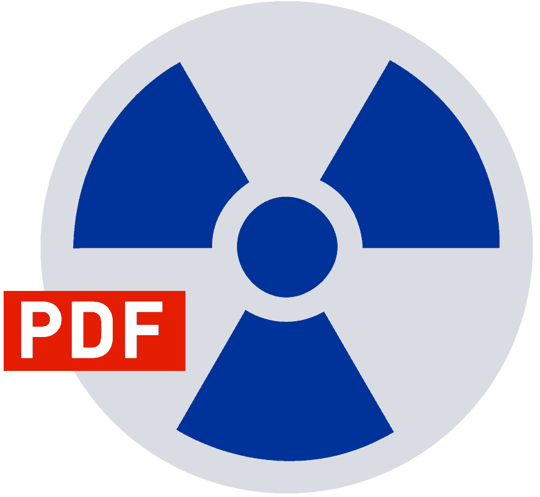

<p align="center"></p>

# Laravel PDFreactor
A PHP wrapper for using PDFreactor with Laravel 6+.

## Setup

### Requirements

* Illuminate/Support 6.0+.
* GuzzleHttp/Guzzle ^6.3.1 Or ^7.0.1

### Installation

```
# Install package
composer require ssgglobal/pdfreactor

# Publish Config
php artisan vendor:publish --provider="StepStone\PdfReactor\ServiceProvider"
```

The `pdfreactor` config options will be merged into `config/services.php`.

## Register Service Provider
In your `config/app.php` add the following to `providers` array.

```
'providers' => [
    StepStone\PdfReactor\ServiceProvider::class,
],
```

### Configuration
Set your PDFreactor configuration options in .env

| Option  | Default  |   |
|---|:-:|---|
| PDFREACTOR_HOST | none  | URL to PDFreactor web service. |
| PDFREACTOR_PORT | 9243  | Default listener port for PDFreactor server. |
| PDFREACTOR_KEY | none | API Key if authentication is enabled. |

### Register Alias (optional)
In your `config/app.php` add the following in the `alias` array.

```
'aliases' => [
    'PdfReactor'    => StepStone\PdfReactor\Facade::class,
]
```

## Usage

For a full list of functions visit [PDFreactor's](https://pdfreactor.com) website.

```
    $config = [
        // PDFreactor config options
    ];

    $document   = PdfReactor::convertAsync($config);
```